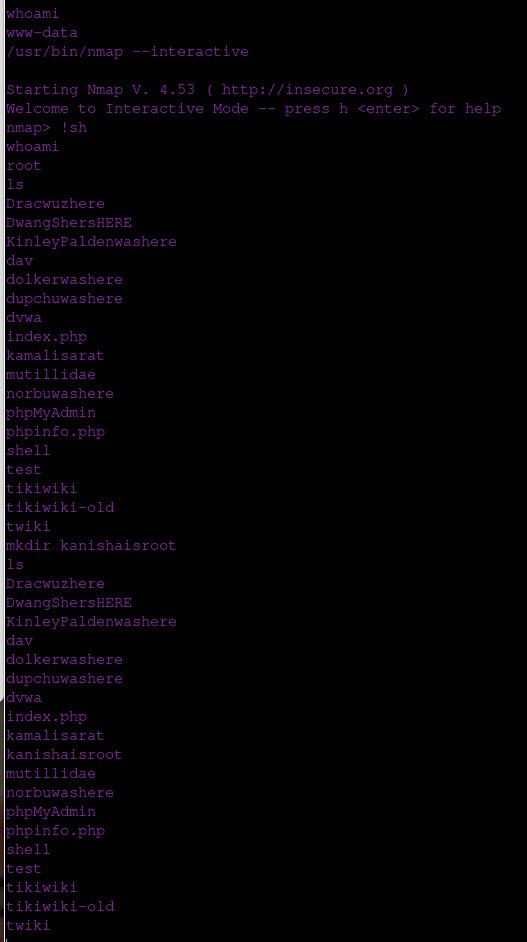

# Machine 10.3.21.140
### Execution summary

In this cap we are given an ip address and asked to perform scans and vulnerability tests for the target IP address. 

So to start with I first searched the IP address on a browser and the instruction asked to hack into this server and gain root shell.

### Approach
Tesing was done with the nmap scan in the college wifi where the Machine was available. Vigorious scanning was done and the ports were exploited with the help of metasploit using auxilaries.

### Scope 
The scope of this assignment is to gain root access of this machine by exploiting ports.

### Detailed walkthrough
### Scans
A simple nmap scan was done in the DSA wifi 

> sudo nmap -O 10.3.21.140 

Here we gave root access to do the nmap OS scan.Doing this we found that there are two open ports in this server.

- 22/tcp open ssh
- 80/tcp open http  

Next we did a nmap scan to detect the version of the services running on the target.

> sudo nmap -sV 10.3.21.140 

Here we found the version of the services on the open ports.

- 22/tcp   open   ssh          OpenSSH 4.7p1 Debian 8ubuntu1 (protocol 2.0)
- 80/tcp   open   http         Apache httpd 2.2.8 ((Ubuntu) DAV/2)

We also did a level two verbosity scan to get more information for us.

We did a port scan for both the open ports just to see if we get any more info but that didnt give us any new information. 

Next we did a fuff scan so that we get more information about the target ip. Below you can see that there are many web pages available.

The image below shows the ports open in the incubation wifi. Where you can see that there are a lot more ports open.

We saw port 3306 open with the version of mysql and tried getting into the database as follows. We saw the databases and used the dvwa database where we saw the users and guestbooks table.

As the users table seemed more intruiging, we selected all the the contents from the table to show.

With the possibility of the above mentioned users and password could give us root access, we cracked the password hash using crackstation and got the password. We tried these usernames and password in the php login page but we had no luck there.

Next we tried to get into the postgesql database and created tables to know that we had access to the database.

The next scan we did was in the ICTO WiFi, where we got many ports open.

Here we tried exploiting ftp port 21 by trying the password as "user" which got into the ftp shell. We tried listing the directories or files but that didnt work so we tried listing the hidden files using 

> ls -a 

This nmap scan was done from the student wifi which had equally more ports open as the icto wifi 

## Exploit 

All of the exploits that we were able to do was through metasploit using auxiliaries available there.

### Port 80

Opening the msfcole for metasploit we searched for php_cgi 

We used the php_cgi argument injection and set the RHOSTS and LPORT to the target ip address and port number.

After exploting it a meterpreter session is created where we can access the shell.

Then we checked who the user was using whoami command and that was not the root.

Using the following command we made a interactive nmap session 
> /usr/bin/nmap --interactive 

Then we got the root access to port 80

Expecting to find some useful information we cd'ed into dvwa but got the same information we did before using mysql.

### Port 445
Here again using metasploit we searched for trans2open module which is capable of exploiting the buffer overflow vulnerability of the samba smbd.

We set the rhosts to target ip and the looked at the payloads.

The we set the payload to linux/x86/shell_reverse_tcp and exploited port 445.

### port 5432

In the msfconsole we searched for postgres as the port 5432 is a postgres server.

We used the postgres_payload exploit. 

Then we set the rhosts, lhosts and lport to the desired values and exploited. Then as we did in the previous exaample of meterpreter session, we made the nmap shell interactive and got root access.

### port 5900

Here we will be exploiting VNC port 5900 on 10.3.21.140 using metasploit.

We run the "search vnc' command to search for available modules related to VNC vulnerabilities 

We use the “auxiliary/scanner/vnc/vnc_login” module, which is used to perform a login brute-force attack on VNC services to test for weak credentials and gain unauthorized access.

We set the Rhosts to our target ip and STOP_ON SUCCESS to true.

After the auxiliary module execution is complete we  see that the password is "password" then we open a vnc viewer 

In this VNC server we can see who is the user and the user is root.

### port 6667

Unreal is a module to exploit backdoor. We will use this module to exploit port 6667 UNREALIRCd

We used the backdoor exploit .

We set the Rhosts and looked at the payloads 

We set the payload to bind ruby.

And then exploiting it we get the root access.

### port 8180

tomcat is an exploit to get login credentials for the port 8180 which needs a username and password

So we used the tomcat module to get the login credentials.

We use the tomcat_mgr_login 

 
We set the rhosts as target ip and rport as target port and STOP_ON_SUCCESS as true.

We got a success message on username and password as tomcat so we logged into tomcat port 8180.

## Conclusion 

This machine is a very vulnerable and highly insecure. There are many other exploits that can be done on this machine by attackers. It is recommended that you update the machine with the latest version.
