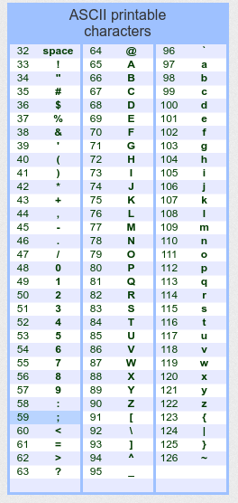
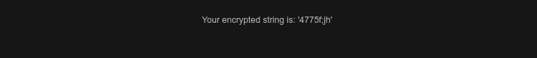
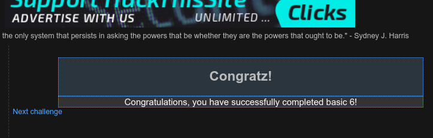

# Bug Bounty 

## URL 1: www.hackthissite.org

In this site i have registered with my email addressand logged in.

what i have found in this site is that we can do the basic challenges doing bug bounties.

### level one of the basic challenge 

In the above picture it shows the source code of the challenge which contains the password for this challenge.

### level two of the basic challenge

Here as we can see the instructions says that sam forgot to upload the password file it means that there is no password for this challenge.

### level three of the basic challenge

To see if we get any information from the source code of this file we checked it and found a hidden input which is stored in password.php so we went into the password.php directory from the url.

Going to password.php we found the password for this challenge.

### level four of the basic challenge

In this challenge we are going to change where the password is being sent to.

Going to inspect page of this site we can change the email to my email which the password is being sent to.

I have recieved the password in my email 

### level five of the basic challenge

Similar to the previous challenge we changed the email where the password is being sent to from the inspect form.

### level six of the basic challenge

First we tried to check what the encryption method is used here so we tried to encrypt 12345 for which we got the answer 13579

Here we can see a pattern where the pasword is being incremented by 1 each time we go further like 
- the first number remains the same 
- the second number is incremented by 1
- the third number is being incremented by 2 and so on.

So applying this concept of the given encrypted password i decremented it one by one 

To do that i used the ascii table to check for the values before a semicolon 

The encrypted code is 4652b6da

### level 7 of the basic challenge

Here we inserted an injection and we get an php file url which we can use to get the password.

### level 8 of the basic challenge 

I tried an injection here again and from here we got the path to the php file containing the password.

### level 9 of the basic challenge
To do this we need to go back to challenge 8 and insert an injection with the level 9 reference in the injection. 

We get a php file path and going to that path we get the password for this challenge

## URL 2: 10.3.21.141:8008

In gruyere I created an account 

### privilege elevation 

By inserting this query into the url we get admin access where we can delete accounts.

We got the access to manage this server and add snipets

## URL 3: 10.3.21.141:8000

Here in this site i had already created an acccount so i tried an injection 

